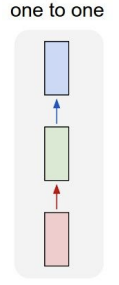

# RNN  

## RNN  
* Vanilla Neural Network  

* 입출력이 다양한 RNN  

* one to many : Image Captioning  
* many to one : Sentiment Classification  
* many to many : Machine Translation or Video classification on frame level  

* RNN의 흐름  
    * 입력을 받는다.  
    * 모든 step마다 Hidden state를 update 한다.  
    * 출력 값을 내보낸다.  

* 매 step마다 x가 들어오고 기존에 있던 old state를 가지고 새로운 state를 update한다.  

* 원-핫 인코딩을 이용.  
* 다음에 올 문자를 예측.  

* 하나의 출력값을 알기 위해 처음부터 모든 Loss값을 알아야 함.  
* 계산량이 너무 큼.  
* 비효율적임.  

* 한 스텝을 일정 단위로 나눈 후, 부분의 loss들만 계산.  

## Image Captioning  
* 사진을 보고 사진이 무엇인지 설명하는 문장을 만들어 내는 것.  

* CNN구조를 통과한 결과가 RNN의 입력으로 들어감.  
* 결과는 모두 Supervised Learning  

## Image Captioning with Attention  

* 좀 더 발전된 방법.  
* caption을 생성할때 이미지의 다양한 부분을 집중해서 본다고 해서 Attention이라 함.  
* CNN으로 공간적인 정보를 가지고 있는 Grid of vector를 만듬.  
* VQA : 입력이 image와 image에 관련된 질문.  

## Vanilla RNN Gradient Flow  

* RNN 하나의 cell을 통과할 때 마다 가중치 행렬의 일부를 곱하게 됨.  

* 전체적인 cell로 gradient를 구하게 되면 많은 W 행렬들이 개입하여 계산량이 늘어남.  
* Weight 행렬에서 특이값의 최대값에 따라 Gradient가 폭발적으로 증가 or 너무 작게 감소 할 수 있는 문제가 발생.  

## LSTM  

* 특징 : 4가지 gate가 있음
    * input gate : cell에 대한 입력(xt에 대한 가중치)  
    * forget gate : 이전 cell에 대한 정보를 얼마나 지울 것인지?  
    * Output gate : ct를 얼마나 밖으로 드러낼 것인지?  
    * Gate gate : cell을 얼마나 포함 시킬 것인지?  

* 하나의 cell에서 Weight 행렬을 거치지 않고도 cell단위에서 gradient 계산이 가능.  
* 여러 cell을 거치더라도 계산량이 크게 증가하지 않음.  
* forget gate와 곱해지는 연산이 행렬단위 연산이 아니라 element-wise이기 때문에 계산량이 크게 증가하지 않음.  
* CNN의 구조와 비슷.  