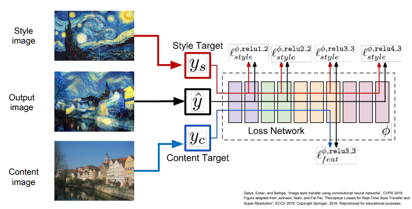

# Visualizing and Understanding  

## Convnet에서 일어나는 일?  
* visualizing이 중요한 이유?  
    * 딥러닝이 잘 작동하는 이유를 시각화하여 설명하기 위해  

* First Layer의 filter들을 시각화 함.  
* 이미지 내의 edge같은 특징들을 뽑아냄.  
* 층이 깊어질수록 직관적으로 이해할 수 없는 필터들이 생김.  
* Last Layer의 경우 4096차원의 특징벡터를 2차원으로 축소(PCA, t-SNE)  
    * 그림처럼 2차원으로 군집화 함.  

### Maximally Activating Patches  
* Visualizing intermediate feature의 다른 방법  
* Input image의 특정 patch를 시각화  
* 네트워크에 이미지를 많이 돌린 후, 선택된 채녈의 value를 기록함.  
* 최대 activation에 해당하는 이미지 패치를 시각화 함.  

### Occlusion Experiments  
* 입력의 어떤 부분이 Classification을 결정했는지 알아보는 방법.  
* 입력 이미지의 일부분을 가린 후 분류를 잘하는지 확인하는 작업.  

### Saliency Maps  
  
* 어떤 픽셀을 보고 이미지를 분류했는지 알아보는 방법.  
* 윤곽이 보이니 segmentation을 할 수 있을까??  
    * 가능은 하지만 성능이 나쁨.  

### Intermediate Features via (guided) backprop  
  
* ReLU의 Positive gradient만 살려서 gradient 값을 구하면 더 선명하게 활성화 된 위치를 확인할 수 있다???  

## Gradient Ascent  
* Input Image에서 의존성을 제거함.  
* Gradient Ascent를 실행해 이미지를 합성.  
* Weight를 고정한 후, Input Image의 픽셀을 변경.  
    * 하늘이라는 초기 이미지를 주고, 새의 속성을 갖도록 함.  
* Regularization Term  
    * 특정 뉴런의 값을 Maximize  
    * 자연스러운 이미지로 보이기.  
* 이미지를 만들어내는 방법.  
    1. 처음 이미지를 0으로 초기화 시킴.  
    2. Image의 현재 score를 계산.  
    3. Image pixel 단위에서 Backpropagation을 통해 gradient 값을 구함.  
    4. 이미지를 특정 뉴런이 최대화할 수 있도록 픽셀단위로 update를 진행.  

### Fooling Images / Adversarial Examples  
* 이미지를 속이는 것  
    * 임의의 이미지를 선택한 후, 다른 이미지의 점수를 최대화.  
    * 코끼리 사진에 코알라 점수를 최대화.  
    * 네트워크는 코끼리 사진을 코알라로 분류.  

### Feature Inversion  

* Feature에서 원본이미지들을 다시 생성해 보는 것.  
* 새로 생성된 feature map의 vector들과 원래 image의 feature vector들 간의 distance값을 최소로 하는 것.  
### Texture Synthesis  
* texture의 input 패치를 얻고싶은 아이디어.  
* 고전적인 방법으로는 Nearest Neighbor  
    * 주변의 neighbor 픽셀들을 계산해서 입력 텍스쳐 패치에서 한 픽셀을 복사하는 방식.  
    * 텍스쳐가 복잡해지면 작동이 잘 안됨.  

* Gram Matrix를 이용(서로 다른 공간 정보에 있는 channel들을 가지고 외적을 계산하여 새로운 matrix를 만드는 것)  
    * input data를 뉴럴넷에 입력.  
    * 몇몇 layer에서 feature map을 가져옴.  
    * feature map에서 슬라이드 처럼 서로 다른 특정 픽셀의 특징 벡터를 feature map의 차원으로 추출.  
    * 뽑아낸 특정 feature 벡터를 서로 외적해서 슬라이드 오른쪽 그림처럼 새로운 matrix를 만듬.  
    * 이 과정을 H*W 차원에 대해 수행하여 그 결과를 평균내면, C*C 크기의 gram matrix가 완성.  

### Neural Style Transfer  

* Gram matrix를 재구성하는 것과 Feature를 재구성 하는 것을 합하여 만들어진 이미지 결과가 Neural Style Transfer.  
* Content Image는 최종 이미지가 어떻게 생겼으면 좋겠는지.  
* Style Image는 최종 이미지의 Texture가 어떻게 생겼으면 좋겠는지.  
* 문제점 : forward/backward가 많이 필요해서 매우 느림.  
* 해결책 : 다른 neural network를 사용.  

### Fast Style Transfer  
  
* 아이디어 : 원하는 몇몇 style의 image를 학습시켜서 고정시키고, input image를 content image만 넣어서 단일 네트워크를 학습시키는 것.  
* 네트워크 학습시에는 content loss와 style loss를 동시에 학습시키고 네트워크의 가중치를 업데이트 시킴.  
* 학습이 조금 오래걸리지만 한 번 학습을 시키면 이미지를 입력하면 바로 결과를 볼 수 있음.  
* 단점은 네트워크 하나당 하나의 Style만을 만들수 있음.  