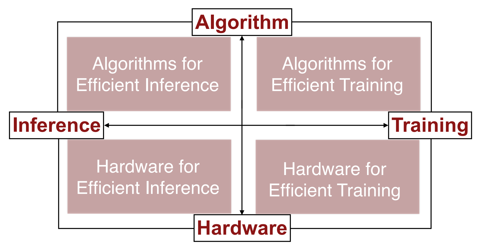
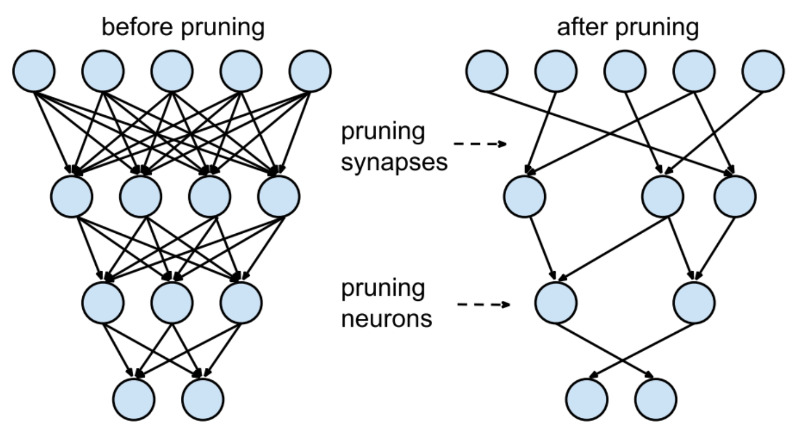

# Efficient Methods and Hardware for Deep Learning  

* Challenge  
    * Model size : getting larger  
    * Speed
    * Energy Efficiency  
  

## Algorithms for Efficient Inference  
### Pruning(가지치기)  

* 장점
    * 추론 속도가 빨라짐(파라미터가 줄어들기 때문에)  
    * Regularization이 일반화 성능을 높인다.  
* 단점  
    * 정보의 손실이 생긴다.  
    * 입자도(세밀함)가 하드웨어 가속 디자인의 효율성에 영향을 미친다.  
### Weight Sharing  
* 하나의 커널이 뉴런의 볼륨을 stride하며 모든 커널이 동일한 가중치를 갖는다는 것을 의미함. 이는 또한 이러한 가중치, 즉 볼륨을 지나며 모든 커널이 학습하는 동안에도 동일하게 유지된다는 것을 의미함.
### Quantization  
* 모델의 파라미터를 lower bit로 표현함으로서 계산과 메모리 access 속도를 높이는 경량화 기법.  
* 보통 32비트 부동소수점 연산을 8비트 정수로 변환하는 방식을 사용.  
* 종류  
    * Post training된 모델을 quantization 하는 post training quantization  
    * 학습을 통한 quantization을 simulate하는 quantization aware training  
* 장점  
    * 모델 사이즈 축소(저장 용량 효율화)  
    * RAM 메모리 bandwith 절약  
    * 추론 속도 개선  
    * 전력 소비 효율화  
* 단점  
    * model accuracy가 저하됨  
### Low Rank Approximation(행렬분해)  
* 기존의 모델은 텐서로 이루어져 있음. 텐서 모델을 low-rank로 decompose하여 낮은 랭크의 텐서들로 분해시켜 근사한다. 이때 분해햐여 얻어낸 텐서들은 essential part이므로 일종의 kernel이라고 볼수도 있음.  
* 복잡한 convoultion layer 하나를 두개의 간단한 convolution layer로 분할하는 방법.  
### Binary / Ternary Net  
* Tenary Net의 경우 weight를 -1, 0, 1 3가지로만 표현하는 방법.  
* Binart는 0, 1로만 표현하는 경량화된 network  
### Winograd Transformation  
* convolution 연산 시 winograd transformation을 적용하면 matrix multiplication의 time complexity를 낮출 수 있음.  
* 동일한 연산을 효율적으로 수행하는 것이므로 loss 없이 동일한 결과를 더 적은 시간 내에 얻을 수 있음.  

## Hardware for Efficient Inference  
* common goal : minimize memory access  
### Google TPU
* 당시 GPU와 비교했을때, matrix unit이 매우 커서 한 사이클에 가능한 matrix multiplication 수가 많은 것이 특징.  
* on-chip buffer와 on-chip memory의 크기가 당시 GPU에 비해서 비교적 큼.  

## Algorithms for Efficient Training  
### Parallelization  
* 학습시 가장 효율적인 방법 중 하나  
* 학습시 병렬적으로 학습을 하는 방법.  
* Data parallel 방법은 여러 데이터를 동시에 학습하는 방법을 뜻함. 각 worker들은 동일한 모델을 copy하여 보유하고 weight update는 parameter server에서 발생함.  
* Model parallel 방식은 모델을 쪼개어 여러 worker에서 병렬 연산을 진행함.  
### Mixed Precision with FP16 and FP32  
* FP16연산이 FP32 연산에 비해서 logic의 크기나 소모전력이 낮아서 효율적임을 이용하는 것.  
* 그러나 FP16의 곱셈 결과는 FP32로 저장해야 정확도가 보장됨.  
* 따라서 gradient를 accumulate하고 weight update할 때만 FP32를 쓰고, 나머지 부분에서 FP16을 사용하면 전체 연산 효율을 증가시킬 수 있음.  
### Model Distillation  
* Teacher Model을 이용하여 상대적으로 크기가 작은 student model을 학습시킴.  
### DSD : Dense-Sparse-Dense Training  
* 원본 아키텍처를 학습시킨 이후, Pruning으로 핵심 parameter만 남긴 후, 나머지 parameter를 re-training을 함.  
* 나무에서 큰 뼈대를 먼저 학습한 후 잔가지를 학습하는 방법.  
* 같은 아키텍처를 더 좋은 local minima로 이끄는 방법.  

## Hardware for Efficient Training  
